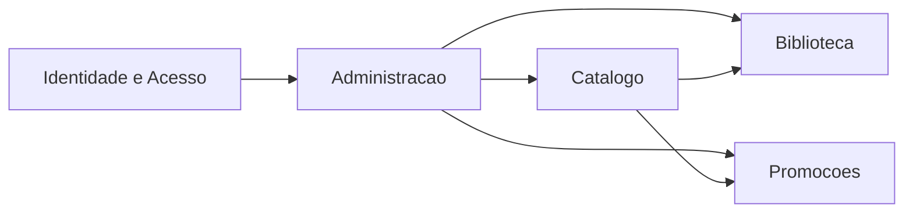
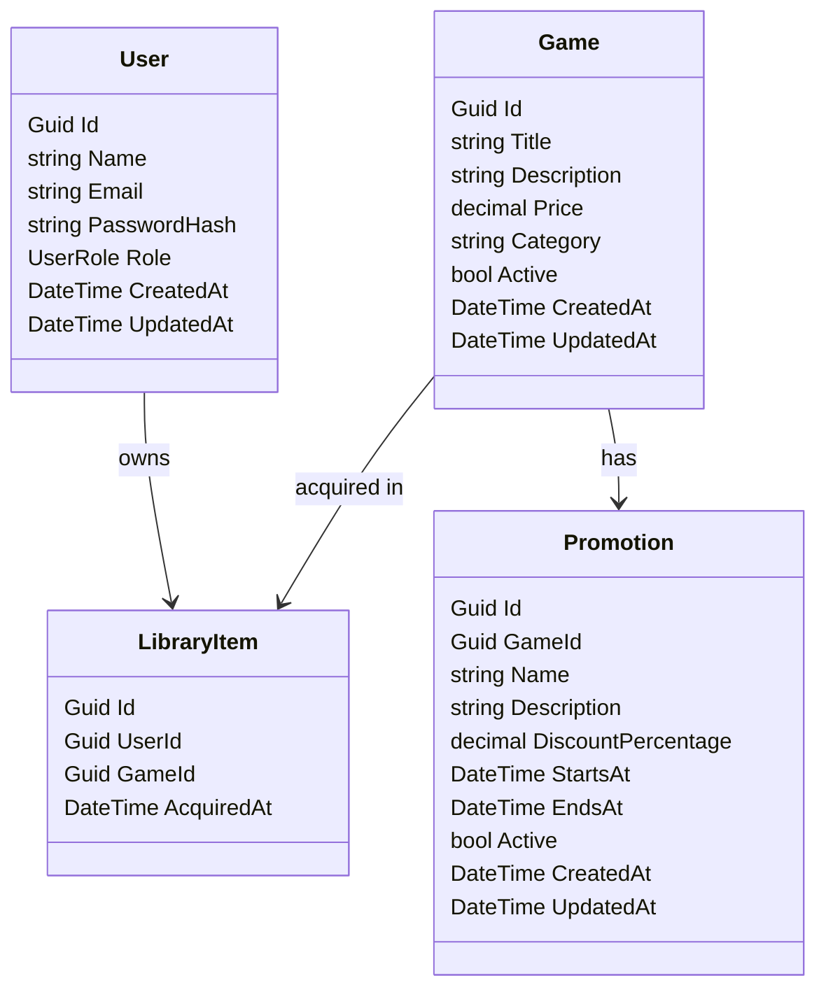
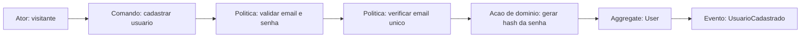
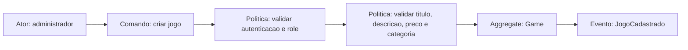
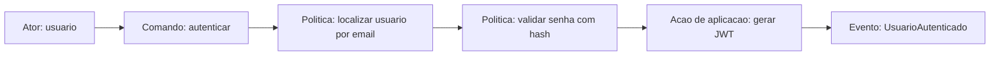
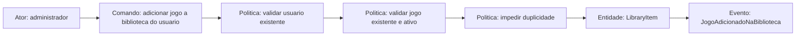
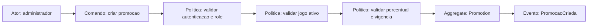

# DDD e Event Storming - FIAP Cloud Games Fase 1

## Objetivo

Este documento consolida a modelagem de dominio da Fase 1 da plataforma **FIAP Cloud Games (FCG)**.

Ele foi produzido como **equivalente local ao Miro**, cobrindo:

- subdominios e bounded contexts
- linguagem ubiqua
- agregados e entidades principais
- fluxos de Event Storming
- diagramas de apoio para a demonstracao da fase

## Escopo da Fase 1

O escopo obrigatorio desta fase cobre:

- cadastro de usuarios
- autenticacao com JWT
- autorizacao com perfis `User` e `Administrator`
- cadastro e administracao de jogos
- biblioteca de jogos adquiridos
- criacao de promocoes por administrador

## Subdominios e bounded contexts

- `Identidade e Acesso`
  Cadastro de usuarios, login, hashing de senha, JWT e papeis.
- `Catalogo`
  Cadastro, consulta e administracao de jogos.
- `Biblioteca`
  Vinculo entre usuario e jogo adquirido.
- `Promocoes`
  Descontos percentuais aplicados a jogos ativos.
- `Administracao`
  Casos de uso protegidos por role `Administrator`.

## Linguagem ubiqua

| Termo | Significado no dominio |
| --- | --- |
| `User` | Usuario da plataforma, autenticado com email e senha |
| `Administrator` | Usuario com privilegios administrativos |
| `Game` | Produto digital disponivel no catalogo |
| `LibraryItem` | Registro de um jogo adquirido por um usuario |
| `Promotion` | Desconto percentual com inicio e fim de vigencia |
| `Catalog` | Colecao de jogos ativos disponiveis para consulta |
| `Acquire game` | Vincular um jogo ao acervo de um usuario |

## Context map

Leitura:

- `Administracao` depende da identidade do usuario autenticado.
- `Biblioteca` depende de `User` e `Game`.
- `Promocoes` depende de `Game` ativo.

## Modelo de dominio

### Agregados e entidades principais

- `User`
  Aggregate root do contexto de identidade.
- `Game`
  Aggregate root do contexto de catalogo.
- `LibraryItem`
  Entidade do contexto de biblioteca, associando `User` e `Game`.
- `Promotion`
  Aggregate root do contexto de promocoes.

### Relacionamentos principais

## Regras de negocio

- um `User` precisa ter nome obrigatorio
- o email do `User` precisa ter formato valido
- o email do `User` precisa ser unico
- a senha precisa ter no minimo 8 caracteres, letras, numeros e caractere especial
- apenas `Administrator` pode administrar jogos, usuarios e promocoes
- um `Game` nao pode ter preco negativo
- um `LibraryItem` nao pode duplicar o mesmo `Game` para o mesmo `User`
- uma `Promotion` so pode ser criada para `Game` ativo
- uma `Promotion` precisa ter percentual maior que `0` e menor ou igual a `100`
- uma `Promotion` precisa ter janela de vigencia valida

## Event Storming

### Fluxo 1 - Criacao de usuario

Passos:

1. o cliente envia `nome`, `email` e `senha`
2. o sistema valida formato e politica de senha
3. o sistema verifica unicidade do email
4. o sistema gera o hash da senha
5. o sistema cria e persiste o `User`
6. o sistema retorna sucesso

### Fluxo 2 - Criacao de jogo

Passos:

1. o administrador autentica
2. envia dados do jogo
3. o sistema valida role e payload
4. cria o `Game`
5. persiste o jogo
6. retorna sucesso

### Fluxo 3 - Login

### Fluxo 4 - Vinculo de jogo a biblioteca

### Fluxo 5 - Criacao de promocao

## Casos de uso mapeados

### Usuario

- registrar conta
- autenticar
- consultar perfil autenticado
- consultar catalogo
- consultar promocoes
- consultar propria biblioteca

### Administrador

- autenticar
- criar jogo
- atualizar jogo
- desativar jogo
- listar usuarios
- alterar papel de usuario
- vincular jogo a biblioteca de usuario
- criar promocao

## Mapeamento para o codigo

- `Identidade e Acesso`
  `src/Fcg.Domain/Users`
  `src/Fcg.Application/Users`
  `src/Fcg.Application/Authentication`
- `Catalogo`
  `src/Fcg.Domain/Games`
  `src/Fcg.Application/Games`
- `Biblioteca`
  `src/Fcg.Domain/Libraries`
  `src/Fcg.Application/Libraries`
- `Promocoes`
  `src/Fcg.Domain/Promotions`
  `src/Fcg.Application/Promotions`
- `Persistencia`
  `src/Fcg.Infrastructure/Persistence`

## Conclusao

Esta modelagem atende os requisitos de DDD da Fase 1 ao:

- separar o dominio por responsabilidades claras
- mapear fluxos centrais por Event Storming
- explicitar entidades, agregados e regras de negocio
- alinhar a estrutura do codigo aos bounded contexts principais do MVP
