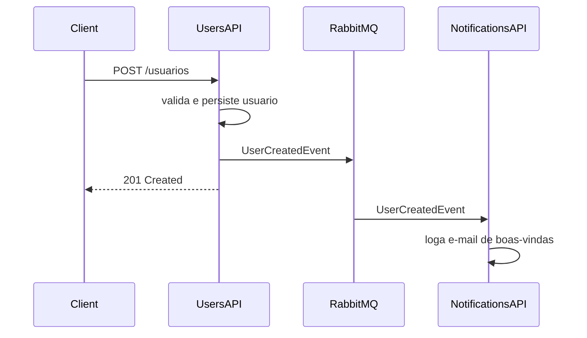
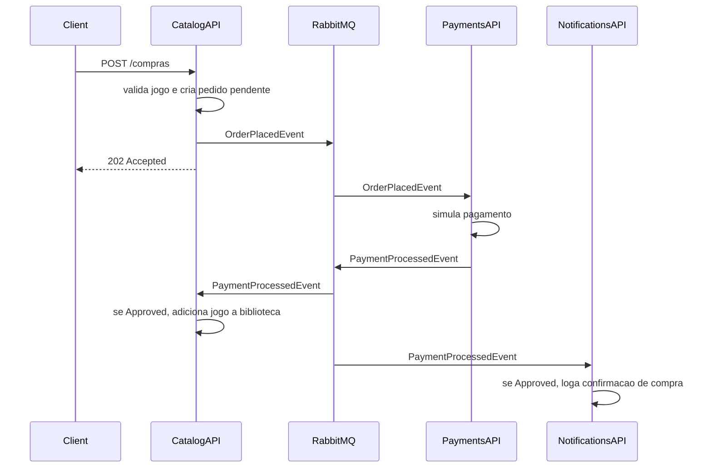

# Fase 2 - Planejamento da Decomposicao

Este documento fecha o primeiro passo da Fase 2: definir como o monolito da Fase 1 sera dividido em microsservicos, quais dados pertencem a cada servico e quais eventos sustentam os fluxos obrigatorios.

## 1. Decisoes Iniciais

- Arquitetura alvo: microsservicos orientados a eventos.
- Plataforma: `.NET 8`.
- Broker recomendado: `RabbitMQ`.
- Biblioteca recomendada: `MassTransit`.
- Orquestracao local: `docker-compose`.
- Orquestracao de implantacao: Kubernetes local com `Deployment`, `Service`, `ConfigMap` e `Secret`.
- Repositorio de orquestracao: recomendado, para centralizar `docker-compose.yml`, manifests consolidados e README principal.
- Banco por servico: cada microsservico que persiste estado tera seu proprio banco.
- Banco recomendado para o MVP academico: `SQLite` por servico, mantendo a reproducao simples; se o grupo preferir maior proximidade com producao, trocar por PostgreSQL por servico.

## 2. Repositorios

| Repositorio | Finalidade | Origem no monolito |
| --- | --- | --- |
| `fcg-users-api` | Cadastro, autenticacao, JWT e administracao basica de usuarios | `UsersController`, `AuthController`, dominio `Users`, casos de uso de `Users` e `Authentication` |
| `fcg-catalog-api` | Catalogo de jogos, promocoes, biblioteca e inicio do fluxo de compra | `GamesController`, `PromotionsController`, `LibrariesController`, dominios `Games`, `Promotions` e `Libraries` |
| `fcg-payments-api` | Processamento simulado de pagamentos | Novo servico |
| `fcg-notifications-api` | Notificacoes simuladas por log no console | Novo servico |
| `fcg-orchestration` | Compose, Kubernetes, documentacao de execucao e relatorio final | Novo repositorio |

## 3. Responsabilidades por Servico

### 3.1 UsersAPI

Responsavel por:

- Cadastro de usuarios.
- Validacao de nome, e-mail e senha forte.
- Hash de senha.
- Login.
- Geracao de JWT.
- Consulta do usuario autenticado.
- Listagem administrativa de usuarios.
- Alteracao administrativa de perfil.
- Publicacao de `UserCreatedEvent`.

Endpoints migrados:

- `POST /usuarios`
- `GET /usuarios/me`
- `GET /usuarios`
- `PATCH /usuarios/{userId}/perfil`
- `POST /auth/login`

Dados pertencentes ao servico:

- `User`
- `Email`
- `UserRole`
- `PasswordHash`
- configuracoes de JWT

O UsersAPI nao deve depender de CatalogAPI, PaymentsAPI ou NotificationsAPI.

### 3.2 CatalogAPI

Responsavel por:

- CRUD de jogos.
- Consulta de catalogo.
- Criacao e consulta de promocoes.
- Biblioteca de jogos do usuario.
- Inicio do fluxo de compra.
- Publicacao de `OrderPlacedEvent`.
- Consumo de `PaymentProcessedEvent`.
- Inclusao de jogo na biblioteca apenas apos pagamento aprovado.

Endpoints migrados/adaptados:

- `GET /jogos`
- `POST /jogos`
- `PUT /jogos/{gameId}`
- `DELETE /jogos/{gameId}`
- `GET /promocoes`
- `POST /promocoes`
- `GET /biblioteca`
- substituir `POST /usuarios/{userId}/biblioteca/{gameId}` por endpoint de compra, recomendado:
  - `POST /compras`
  - ou `POST /jogos/{gameId}/compras`

Dados pertencentes ao servico:

- `Game`
- `Promotion`
- `LibraryItem`
- `Order` ou `PurchaseRequest`, se for necessario rastrear pedidos iniciados

Observacao importante:

- O `CatalogAPI` pode confiar no `UserId` vindo do JWT para consultar biblioteca e iniciar compra.
- Para o MVP, nao e obrigatorio validar via HTTP se o usuario existe no UsersAPI, porque isso aumentaria acoplamento sincrono. O token emitido pelo UsersAPI ja carrega a identidade.

### 3.3 PaymentsAPI

Responsavel por:

- Consumir `OrderPlacedEvent`.
- Simular pagamento.
- Publicar `PaymentProcessedEvent`.
- Registrar logs do processamento.

Endpoints:

- Nao precisa expor endpoint funcional para o fluxo obrigatorio.
- Deve expor pelo menos `GET /health` para validacao operacional.

Dados pertencentes ao servico:

- `Payment` ou registro simples de pagamento processado, se o grupo decidir persistir auditoria.
- Para o MVP, pode nao persistir dados e apenas publicar o resultado.

Regra de simulacao recomendada:

- Aprovar pagamentos com `Price > 0`.
- Rejeitar pagamentos com `Price <= 0`.
- Opcionalmente aceitar uma variavel `PaymentSimulation__DefaultStatus` para forcar `Approved` ou `Rejected` durante demonstracao.

### 3.4 NotificationsAPI

Responsavel por:

- Consumir `UserCreatedEvent`.
- Simular e-mail de boas-vindas via log.
- Consumir `PaymentProcessedEvent`.
- Simular e-mail de confirmacao de compra quando o pagamento for aprovado.

Endpoints:

- Nao precisa expor endpoint funcional para o fluxo obrigatorio.
- Deve expor pelo menos `GET /health` para validacao operacional.

Dados pertencentes ao servico:

- Nenhum banco obrigatorio para o MVP.
- Logs no console sao suficientes para atender o enunciado.

## 4. Contratos de Eventos

Os contratos devem ser estaveis e versionaveis. Para a entrega academica, a abordagem mais simples e criar uma pasta/projeto compartilhado `Fcg.Contracts` em cada repositorio com o mesmo namespace e os mesmos tipos.

### 4.1 UserCreatedEvent

Publicado por:

- `UsersAPI`

Consumido por:

- `NotificationsAPI`

Campos:

```csharp
public sealed record UserCreatedEvent(
    Guid UserId,
    string Name,
    string Email,
    DateTime CreatedAt);
```

### 4.2 OrderPlacedEvent

Publicado por:

- `CatalogAPI`

Consumido por:

- `PaymentsAPI`

Campos:

```csharp
public sealed record OrderPlacedEvent(
    Guid OrderId,
    Guid UserId,
    Guid GameId,
    decimal Price,
    DateTime PlacedAt);
```

### 4.3 PaymentProcessedEvent

Publicado por:

- `PaymentsAPI`

Consumido por:

- `CatalogAPI`
- `NotificationsAPI`

Campos:

```csharp
public sealed record PaymentProcessedEvent(
    Guid OrderId,
    Guid UserId,
    Guid GameId,
    decimal Price,
    string Status,
    DateTime ProcessedAt);
```

Status permitidos:

- `Approved`
- `Rejected`

## 5. Filas e Exchanges

Recomendacao com MassTransit e RabbitMQ:

| Evento | Exchange | Consumidor | Fila |
| --- | --- | --- | --- |
| `UserCreatedEvent` | configurada pelo MassTransit pelo tipo da mensagem | `NotificationsAPI` | `notifications-user-created` |
| `OrderPlacedEvent` | configurada pelo MassTransit pelo tipo da mensagem | `PaymentsAPI` | `payments-order-placed` |
| `PaymentProcessedEvent` | configurada pelo MassTransit pelo tipo da mensagem | `CatalogAPI` | `catalog-payment-processed` |
| `PaymentProcessedEvent` | configurada pelo MassTransit pelo tipo da mensagem | `NotificationsAPI` | `notifications-payment-processed` |

Cada consumidor deve ter sua propria fila. Assim, CatalogAPI e NotificationsAPI recebem o mesmo `PaymentProcessedEvent` sem competir pela mesma mensagem.

## 6. Bancos por Servico

| Servico | Banco | Tabelas/entidades |
| --- | --- | --- |
| `UsersAPI` | `users.db` | `Users` |
| `CatalogAPI` | `catalog.db` | `Games`, `Promotions`, `LibraryItems`, opcionalmente `Orders` |
| `PaymentsAPI` | opcional: `payments.db` | opcionalmente `Payments` |
| `NotificationsAPI` | nenhum | nenhum |

Decisao para o MVP:

- Persistir `UsersAPI` e `CatalogAPI`.
- Deixar `PaymentsAPI` sem banco no primeiro ciclo, salvo se o grupo quiser demonstrar auditoria de pagamentos.
- Deixar `NotificationsAPI` sem banco.

## 7. Portas Locais

| Servico | Porta HTTP host | Porta container |
| --- | --- | --- |
| `UsersAPI` | `5101` | `8080` |
| `CatalogAPI` | `5102` | `8080` |
| `PaymentsAPI` | `5103` | `8080` |
| `NotificationsAPI` | `5104` | `8080` |
| `RabbitMQ` | `5672` | `5672` |
| `RabbitMQ Management` | `15672` | `15672` |

## 8. Variaveis de Ambiente

### Comuns

- `ASPNETCORE_ENVIRONMENT`
- `ASPNETCORE_URLS`
- `RabbitMq__Host`
- `RabbitMq__Username`
- `RabbitMq__Password`

### UsersAPI

- `ConnectionStrings__UsersDb`
- `Jwt__Issuer`
- `Jwt__Audience`
- `Jwt__SecretKey`
- `Jwt__ExpirationInMinutes`

### CatalogAPI

- `ConnectionStrings__CatalogDb`
- `Jwt__Issuer`
- `Jwt__Audience`
- `Jwt__SecretKey`

### PaymentsAPI

- `PaymentSimulation__DefaultStatus`

### NotificationsAPI

- `Notifications__FromEmail`

## 9. Fluxos

### 9.1 Cadastro de Usuario



### 9.2 Compra de Jogo



## 10. Ordem de Implementacao Recomendada

1. Criar os repositorios locais/base dos quatro microsservicos e da orquestracao.
2. Criar projetos `.NET 8` vazios com health check e Swagger.
3. Extrair `UsersAPI` do monolito.
4. Extrair `CatalogAPI` do monolito.
5. Adicionar RabbitMQ e MassTransit.
6. Publicar `UserCreatedEvent`.
7. Criar `NotificationsAPI` consumindo `UserCreatedEvent`.
8. Criar `PaymentsAPI` consumindo `OrderPlacedEvent` e publicando `PaymentProcessedEvent`.
9. Adaptar `CatalogAPI` para publicar pedido e consumir pagamento.
10. Fechar Dockerfiles e `docker-compose`.
11. Fechar manifests Kubernetes.

## 11. Criterio de Aceite da Etapa 1

- Lista de repositorios definida.
- Responsabilidade de cada servico definida.
- Dados pertencentes a cada servico definidos.
- Contratos de eventos definidos.
- Estrategia de banco por servico definida.
- Padrao de portas locais definido.
- Fluxos obrigatorios desenhados.
